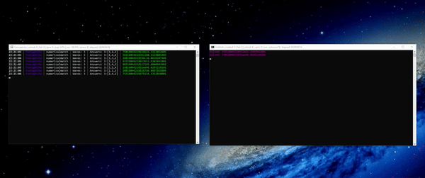

# Arkose Funcaptcha Solver

Funcaptcha Solver made by kek! 🚀
https://t.me/kokandg

## Features
- Proxy HTTPS Support
- 100% Requests Based
- Fully reversed BDA
- Unflagged asf

## Usage

To implement this script in your project, you can follow a similar approach as shown below:

```python
import requests

session=requests.Session()
session.headers={"apikey": "709256.3e9d6f976cac483ebf5a56dc0c474424"}

task=session.post("http://127.0.0.1:8003/funcaptcha/createTask",json={
    "preset": "outlook_register",
    "chrome_version": "130",
    "proxy": self.proxy,
    "blob": blob,
}).json()

while True:
    token=session.post("http://127.0.0.1:8003/funcaptcha/getTask",json={
        "task_id": task["task_id"]
    }).json()

    if token["status"]=="completed":
        return token["captcha"]["token"]

    time.sleep(1)
```

## Showcase



**Remember:** This doesnt include the image classification. If you want classification you can for example use XEvil
